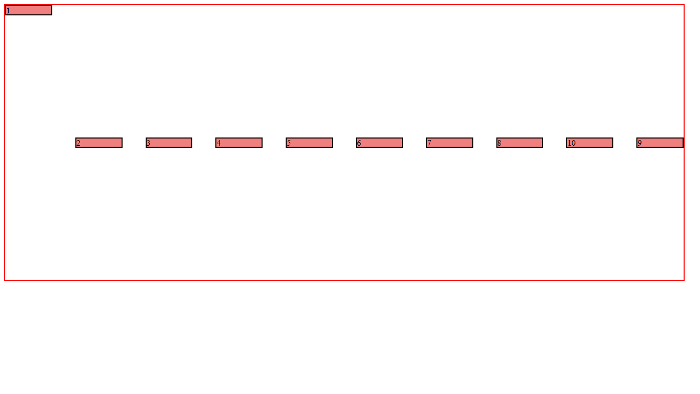

# Flexbox Layout Practice

A CSS practice page focused on Flexbox layout behavior.

## What This Covers

- `display: flex`
- `justify-content` and `align-items`
- `flex-wrap` and `flex-flow`
- Row and column gaps
- Item ordering, growth, and alignment

## Live Demo

[Open the Flexbox demo](https://ss-prateek.github.io/CSS/CSS/21-flexbox/)
