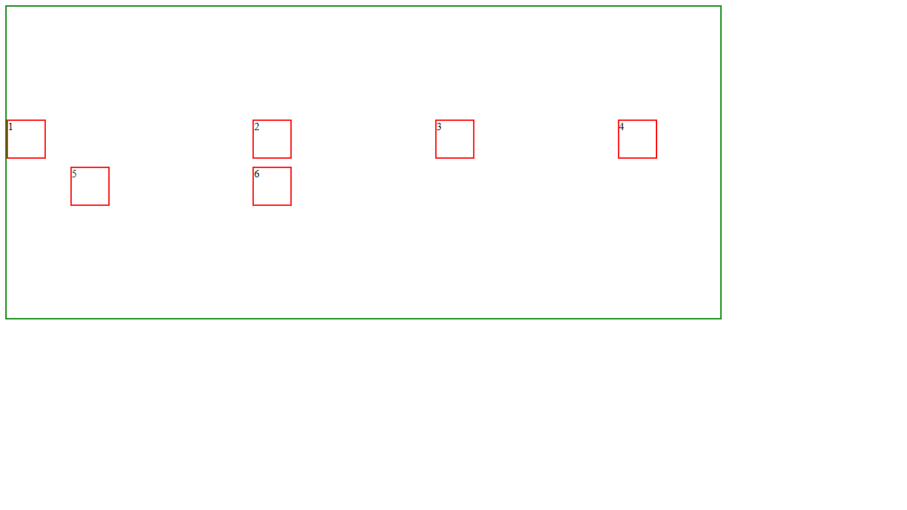

# CSS Grid Layout Practice

A CSS practice page focused on grid columns, spacing, and item placement.

## What This Covers

- `display: grid`
- `repeat()` and `minmax()`
- Row and column gaps
- `place-content`
- `justify-items`, `align-items`, and item self-alignment

## Live Demo

[Open the CSS Grid demo](https://ss-vidit.github.io/CSS/CSS/22-css-grid/)
