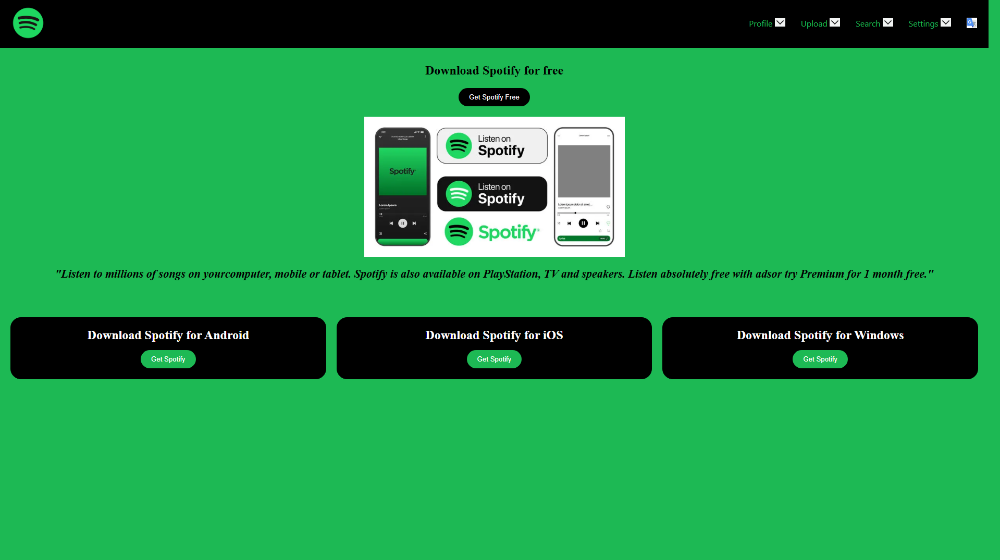
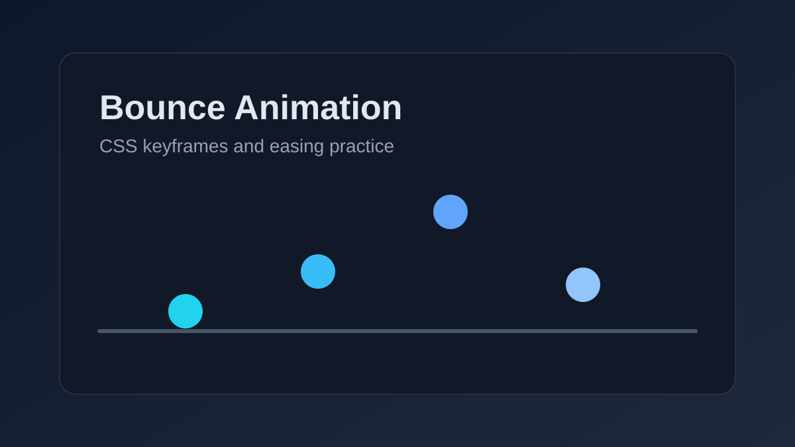
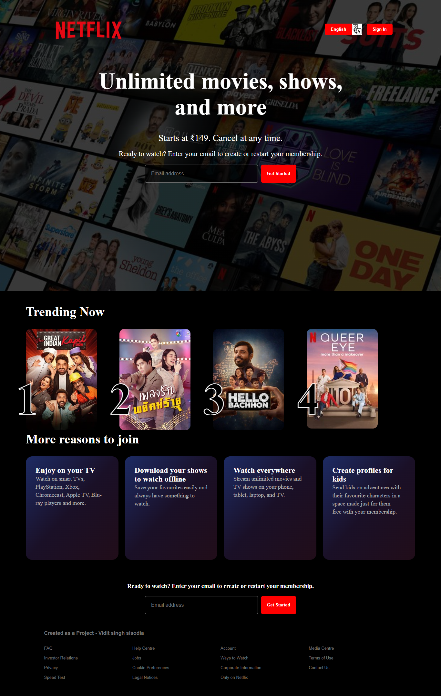

# CSS Learning Journal

A structured collection of CSS practice files from my web development learning journey. This repository tracks the concepts I am learning, the small experiments I build, and the improvements I make as a 2nd-year B.Tech student.

## Live Demos

[Open the CSS demo gallery](https://ss-prateek.github.io/CSS/)

## Featured Mini Projects

| Project | Preview | Live Demo |
| --- | --- | --- |
| Spotify Download Page UI |  | [Open demo](https://ss-prateek.github.io/CSS/CSS/28-spotify-download/) |
| Bounce Animation Practice |  | [Open demo](https://ss-prateek.github.io/CSS/CSS/31-bounce-animation/) |
| Netflix Clone |  | [Open demo](https://ss-prateek.github.io/CSS/CSS/32-netflix-clone/) |

## About Me

I am Vidit Singh Sisodia, a B.Tech student at KIIT, currently building a strong foundation in front-end development. I am using this repository to practice CSS fundamentals, layout systems, responsive design, and real-world UI patterns.

## What This Repository Covers

- CSS syntax and ways to add CSS to HTML
- Selectors, specificity, colors, fonts, and the box model
- Sizing units, display properties, positioning, floats, and media queries
- CSS variables and reusable styling patterns
- Layout practice with Flexbox and CSS Grid
- CSS transforms, transitions, animations, and visual UI experiments

## Folder Index

| Folder | Topic |
| --- | --- |
| `CSS/01-css-basics` | CSS basics |
| `CSS/02-adding-css-to-html` | Inline, internal, and external CSS |
| `CSS/03-css-selectors` | CSS selectors |
| `CSS/04-box-model` | Box model |
| `CSS/05-colors-and-fonts` | Colors and fonts |
| `CSS/06-practice-exercise` | Practice exercise |
| `CSS/07-specificity-and-cascade` | Specificity and cascade |
| `CSS/08-sizing-units` | CSS sizing units |
| `CSS/09-display-property` | Display property |
| `CSS/10-shadows-and-outlines` | Shadows and outlines |
| `CSS/11-list-styling` | Lists and list styling |
| `CSS/12-overflow` | Overflow |
| `CSS/13-positioning` | Positioning |
| `CSS/14-card-design` | Card design practice |
| `CSS/15-css-variables` | CSS variables |
| `CSS/16-media-queries` | Media queries |
| `CSS/17-multicolor-website` | Multicolor website practice |
| `CSS/18-float-and-clear` | Float and clear |
| `CSS/19-advanced-selectors` | Advanced selectors |
| `CSS/20-layout-practice` | Layout practice |
| `CSS/21-flexbox` | Flexbox layout practice with wrapping, alignment, gaps, and item ordering |
| `CSS/22-css-grid` | CSS Grid practice with responsive columns, alignment, and spacing |
| `CSS/23-navigation-bar-layout` | Navigation bar layout |
| `CSS/24-css-transforms` | CSS transforms |
| `CSS/25-flexbox-practice` | Flexbox practice layout |
| `CSS/26-Transition-Property` | CSS transition property |
| `CSS/27-animations` | Keyframe animation and transform practice |
| `CSS/28-spotify-download` | Spotify-inspired download page UI project |
| `CSS/29-object-fit&cover` | Object-fit and object-cover image behavior practice |
| `CSS/30-filters` | CSS filter effects and visual styling practice |
| `CSS/31-bounce-animation` | Bounce animation using CSS keyframes |
| `CSS/32-netflix-clone` | Netflix-inspired responsive landing page project |

## Current Focus

- Writing cleaner and more readable CSS
- Building responsive layouts
- Practicing Flexbox and Grid through small UI examples
- Experimenting with transitions and animations
- Improving repository structure and documentation as I learn

## Next Goals

- Add screenshots for selected exercises
- Create mini projects using HTML, CSS, and JavaScript
- Deploy polished practice pages with GitHub Pages
- Refactor repeated styles into cleaner CSS files

## Learning Source

Following the Sigma Web Development Course by CodeWithHarry, with my own practice files and notes added along the way.
